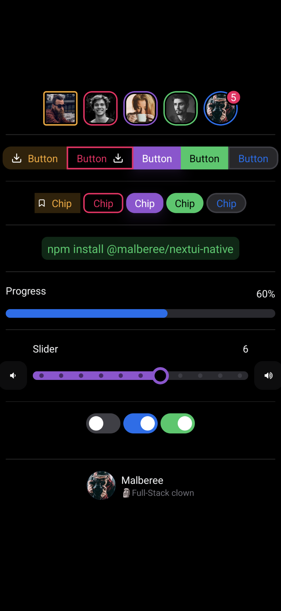
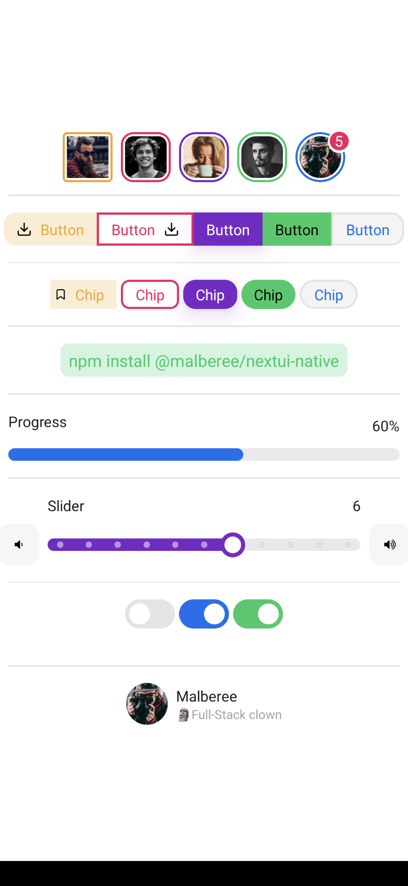

# NextUI for React Native

I'm just trying to replicate the design and some functionality of NextUI for React Native.\
Many of the components do not have the full functionality of the original NextUI library (npm package coming soon).

Here is a list of some of the components that have already been implemented:

- [x] AvatarGroup, Avatar
- [x] Badge
- [x] ButtonGroup, Button
- [x] Chip
- [x] Code
- [x] Divider
- [x] Progress
- [x] RadioGroup, Radio
- [x] Slider
- [x] Switch
- [x] User

    

        
        
    

